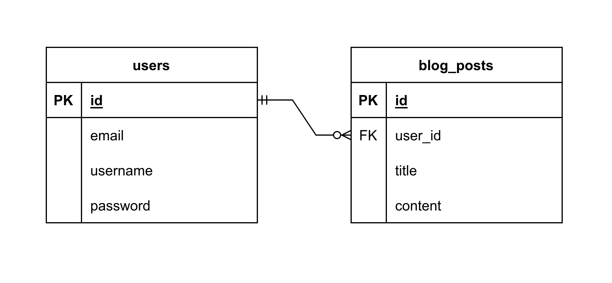

# PERN-Blog

A full-stack project made with the PERN stack (PostgreSQL, Express, React, Node.js).

## Table of contents

-   [Presentation](#presentation)
    -   [Database schema](#database-schema)
-   [How to use](#how-to-use)
    -   [Setup the database](#setup-the-database)
    -   [Setup the server](#setup-the-server)
    -   [Run the server](#run-the-server)
    -   [Run the client](#run-the-client)
-   [Available scripts](#available-scripts)
    -   [Client](#client)
    -   [Server](#server)

## Presentation

### Database schema



## How to use

### Setup the database

1) Make sure that PostgreSQL is installed on your machine.

2) Create a new database :
```sql
CREATE DATABASE your_database_name;
```
3) Use the commands inside `server/config/setup-database.sql` to setup the database. You can copy/paste these commands into [psql](https://www.postgresql.org/docs/current/app-psql.html) or directly inside Visual Studio Code with [SQLTools](https://marketplace.visualstudio.com/items?itemName=mtxr.sqltools) and the appropriate drivers ([SQLTools PostgreSQL/Cockroach/Redshift Driver](https://marketplace.visualstudio.com/items?itemName=mtxr.sqltools-driver-pg)).

4) Go to the server's directory and create an `.env` file with your database configuration. Use `.env.example` to see what are the mandatory info. 

### Setup the server

1) Make sure that [Node.js](https://nodejs.org/en/) is installed on your machine and that you have a package manager (like [npm](https://www.npmjs.com/), [yarn](https://yarnpkg.com/) or [pnpm](https://pnpm.io/)).

2) Go to the server's directory `cd server`

3) Install the dependencies `pnpm install`

4) Edit the `.env` file that you have created while setting up the database and add a password to encrypt your JSON Web Token.

### Run the server

1) Go to the server's directory `cd server`

2) Run the server with `pnpm dev`

### Run the client

1) Go to the client's directory `cd client`

2) Run the server with `pnpm dev`

## Available scripts

#### Client

- To format your code, run `pnpm format`. This will launch Prettier.

- To lint your code, run `pnpm link`. This will launch ESLint.

#### Server

- To format your code, run `pnpm format`. This will launch Prettier.

- To lint your code, run `pnpm link`. This will launch ESLint.
