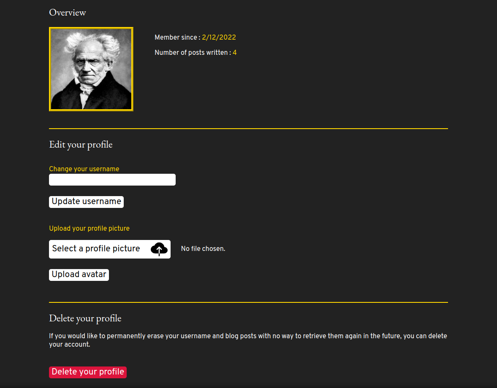
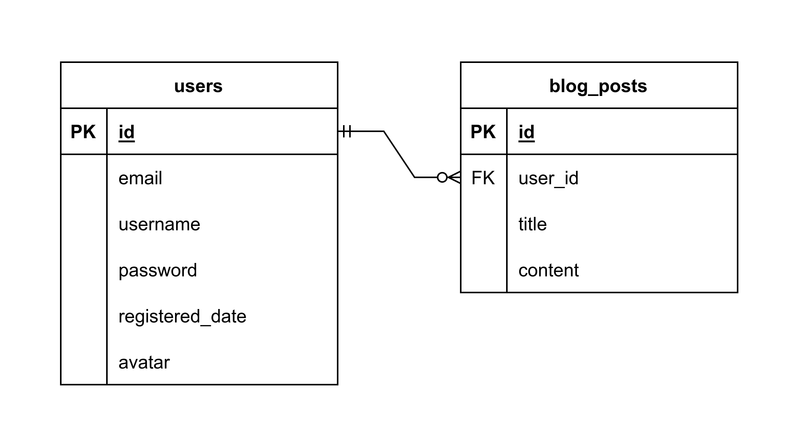

# PERN-Blog

A full-stack project made with the PERN stack (PostgreSQL, Express, React, Node.js).

## Table of contents

-   [Presentation](#presentation)
    -   [About this project](#about-this-project)
    -   [Features](#features)
    -   [Screenshots](#screenshots)
-   [Documentation](#presentation)
    -   [Database schema](#database-schema)
    -   [API documentation](#api-documentation)
-   [How to use](#how-to-use)
    -   [Setup the database](#setup-the-database)
    -   [Setup the server](#setup-the-server)
    -   [Run the server](#run-the-server)
    -   [Run the client](#run-the-client)
-   [Available scripts](#available-scripts)
    -   [Client](#client)
    -   [Server](#server)
-   [Assets credits](#assets-credits)

## Presentation

### About this project

This is a personal project I have made to learn more about backend development. It is a personal blogging platform (called "Scribissimus") where an user can register and make some blog posts.

The front-end part of the project was made with [React](https://reactjs.org/) and [Redux](https://redux.js.org/) as a state manager.

On the server side, I have used [Express](https://expressjs.com/) to build the API and [PostgreSQL](https://www.postgresql.org/) for the database.

### Features

- User management :
    * Registration.
    * Login.
    * Logout.
    * Keeping session active on page refresh with JWT token.
    * Avatar image upload.
    * Account deletion.

- Blog posts management :
    * Create a blog post.
    * Delete a blog post.
    * Edit a blog post.

### Screenshots

Home page :


Blog page :


Profile page :



## Documentation

### Database schema



### API documentation

In order to access the API documentation, first make sure that you have installed the required dependencies (see [Setup the server](#setup-the-server)), then run the server (see [Run the server](#run-the-server)).

Once the server is running, visit http://localhost:5000/api-docs to access the API documentation.

## How to use

### Setup the database

1) Make sure that PostgreSQL is installed on your machine.

2) Create a new database :
```sql
CREATE DATABASE your_database_name;
```
3) Use the commands inside `server/config/setup-database.sql` to setup the database. You can copy/paste these commands into [psql](https://www.postgresql.org/docs/current/app-psql.html) or directly inside Visual Studio Code with [SQLTools](https://marketplace.visualstudio.com/items?itemName=mtxr.sqltools) and the appropriate drivers ([SQLTools PostgreSQL/Cockroach/Redshift Driver](https://marketplace.visualstudio.com/items?itemName=mtxr.sqltools-driver-pg)).

4) Go to the server's directory and create an `.env` file with your database configuration. Use `.env.example` to see what are the mandatory info. 

### Setup the server

1) Make sure that [Node.js](https://nodejs.org/en/) is installed on your machine and that you have a package manager (like [npm](https://www.npmjs.com/), [yarn](https://yarnpkg.com/) or [pnpm](https://pnpm.io/)).

2) Go to the server's directory `cd server`

3) Install the dependencies `pnpm install`

4) Edit the `.env` file that you have created while setting up the database and add a password to encrypt your JSON Web Token.

### Run the server

1) Go to the server's directory `cd server`

2) Run the server with `pnpm dev`

### Run the client

1) Go to the client's directory `cd client`

2) Run the server with `pnpm dev`

3) The app should be available on http://localhost:5173/

## Available scripts

#### Client

- To format your code, run `pnpm format`. This will launch Prettier.

- To lint your code, run `pnpm link`. This will launch ESLint.

#### Server

- To format your code, run `pnpm format`. This will launch Prettier.

- To lint your code, run `pnpm link`. This will launch ESLint.

## Assets credits

- <a href="https://www.flaticon.com/free-icons/feather" title="feather icons">Feather icons created by Freepik - Flaticon</a>
